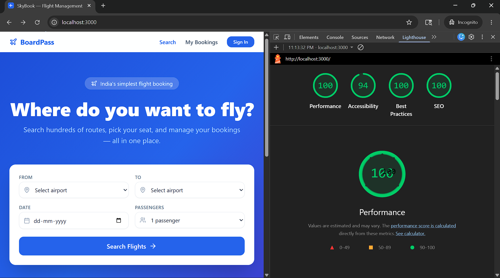
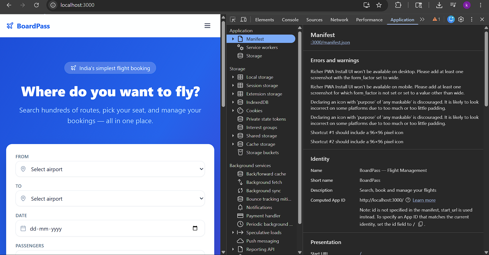
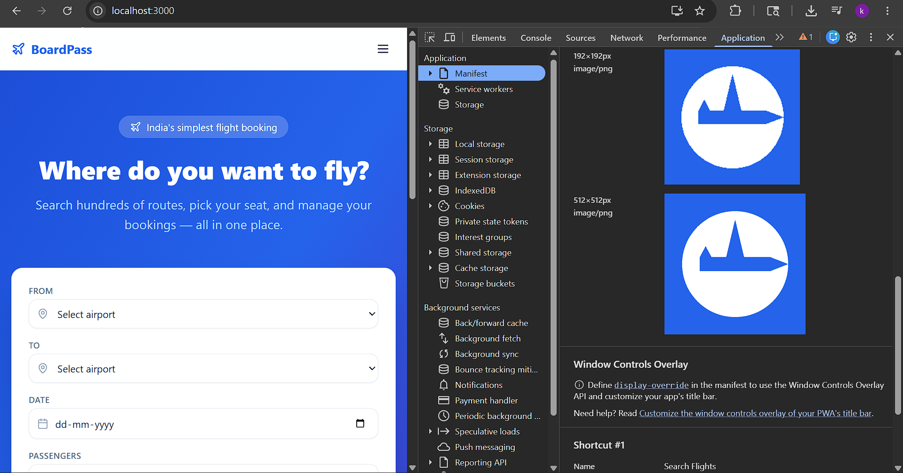

# ✈️ BoardPass — Flight Management PWA

A production-like flight management web app built with **Next.js 14 App Router**, **Supabase**, **Zustand**, and **Tailwind CSS**.

---

## 🚀 Live Demo
> **Production URL:**https://flight-management-app-boardpass.vercel.app/
---

## 🧪 Test Credentials
```
Email:    test@BoardPass.dev
Password: Test@123456
```
Create this account in your Supabase Auth dashboard, or sign up through the app.

---

## 📦 Tech Stack
| Layer | Technology |
|---|---|
| Frontend & API | Next.js 14 (App Router) |
| Database & Auth | Supabase (PostgreSQL + RLS + Realtime) |
| State Management | Zustand with persist middleware |
| Styling | Tailwind CSS |
| PWA | next-pwa |
| Language | TypeScript (strict, no `any`) |

---

## ⚙️ Local Setup

### 1. Clone & install
```bash
git clone https://github.com/your-username/flight-management-app
cd flight-management-app
npm install
```

### 2. Configure environment
```bash
cp .env.example .env.local
```
Fill in your Supabase credentials:
```
NEXT_PUBLIC_SUPABASE_URL=https://your-project.supabase.co
NEXT_PUBLIC_SUPABASE_ANON_KEY=your-anon-key
```

### 3. Run Supabase migrations
In your **Supabase SQL Editor**, run the migration files in order:
```
supabase/migrations/001_schema.sql
supabase/migrations/002_rls.sql
supabase/migrations/003_functions.sql
supabase/migrations/004_seed.sql
```

### 4. Enable Supabase Realtime
In Supabase Dashboard → **Database → Replication**, enable the `seats` table for realtime.

### 5. Run the dev server
```bash
npm run dev
```
Open [http://localhost:3000](http://localhost:3000)

---

## 🗄️ Database Schema

```
flights       id, flight_no, origin, destination, departs_at, arrives_at, aircraft_type, status, base_price
seats         id, flight_id, seat_number, class, is_available, extra_fee
bookings      id, user_id, flight_id, seat_id, status, booked_at, total_price, pnr_code
passengers    id, booking_id, full_name, passport_no, nationality, dob
reschedules   id, booking_id, old_flight_id, new_flight_id, requested_at, fee_charged
```

**Seed data:** 8 flights across 4 routes (DEL↔BOM, BOM↔BLR, BLR↔HYD, DEL↔BLR), each with 180 seats (rows 1–30, columns A–F).

---

## 🔐 Security

### Row Level Security
All tables have RLS enabled. Key policies:
- `flights` and `seats`: **public read** (anyone can see the timetable and seat map)
- `bookings`, `passengers`, `reschedules`: **owner-only** via `auth.uid() = user_id`

### Sensitive Data Exclusion
Passport numbers are **never persisted to localStorage**. `passport_no` is excluded at the **type level** — it is not a field in `PassengerFormData` at all, so it cannot accidentally enter the Zustand store. It lives exclusively in `useState` inside `PassengerForm` for the duration of a single session, and is only ever sent directly to the Supabase RPC over HTTPS.

---

## 🏗️ Zustand Store Architecture

### `useFlightStore` (persisted, `partialize` applied)
```ts
{
  searchQuery,      // Persisted: origin, destination, date, passengers
  selectedFlight,   // Persisted: flight object for in-progress booking
  selectedSeat,     // Persisted: seat object
  currentStep,      // Persisted: booking step
  passengerForm: {
    full_name,      // Persisted
    nationality,    // Persisted
    dob,            // Persisted
    // passport_no  ← NOT persisted (partialize excludes it)
  },
  optimisticSeatId, // NOT persisted: transient optimistic UI state
}
```

**Optimistic seat selection:** When a user clicks a seat, `optimisticSeatId` is set immediately in the store before the Supabase RPC completes. If the RPC fails (seat taken), the error is shown and the optimistic selection is cleared.

**Reset actions:**
- `resetBooking()` — triggered on booking completion or cancellation
- `resetAll()` — triggered on logout

### `useUserStore` (persisted with intentional trade-off)
```ts
{
  session,         // Persisted: access_token + refresh_token only (not full Session object)
  cachedBookings,  // Persisted: required for PWA offline — My Bookings must be readable without connectivity
}
```
> **Trade-off note:** The spec says "persist only the session token" for `useUserStore`, but Task 05 requires My Bookings to be readable offline. These two requirements conflict. We persist `cachedBookings` to satisfy the PWA offline requirement, which is the harder technical constraint. Booking data contains no sensitive fields (passport numbers are never stored anywhere client-side).

---

## 🔒 Concurrency & DB Safety

### Seat-locking RPC (`reserve_seat`)
Uses PostgreSQL `SELECT ... FOR UPDATE` to lock the seat row before checking availability, preventing double-booking under concurrent requests:
```sql
SELECT * FROM seats WHERE id = p_seat_id FOR UPDATE;
-- If is_available = false → return error
-- Else → UPDATE seats SET is_available = false; INSERT booking;
```

### Cancellation 2-hour rule
Enforced at **two layers**:
1. **RPC `cancel_booking`**: checks `departs_at - now() < INTERVAL '2 hours'` before allowing cancellation
2. **DB trigger `enforce_cancellation_window`**: fires `BEFORE UPDATE` on bookings, raises an exception if the 2-hour window is violated — even if someone bypasses the RPC

### Reschedule RPC (`reschedule_booking`)
Atomically frees old seat, reserves new seat, records the reschedule, and updates the booking in a single transaction.

---

## 🛩️ Seat Map

- **30 rows × 6 columns** (A–F) with an aisle gap between C and D
- **Color zones:** First (rows 1–2, gold) · Business (rows 3–8, purple) · Economy (rows 9–30, blue)
- **Realtime:** Subscribes to `postgres_changes` on the `seats` table — occupied states update live without refresh
- **Tooltip on hover:** shows class and extra fee
- **Scrollable and touch-friendly** on mobile (using `overflow-y-auto` and `touch-pan-y`)


---

## 📁 Project Structure

```
src/
├── app/
│   ├── auth/login/         Login page
│   ├── auth/signup/        Signup page
│   ├── flights/            Search results
│   ├── booking/[flightId]/
│   │   ├── seats/          Seat selection
│   │   └── passengers/     Passenger form
│   ├── confirmation/[pnr]/ Booking confirmation
│   ├── bookings/           My Bookings (reschedule, cancel)
│   └── offline/            PWA offline fallback
├── components/             Shared UI components
├── lib/supabase/           Browser, server & middleware clients
├── store/                  Zustand stores
├── types/                  Shared TypeScript interfaces
supabase/
└── migrations/             001–004 SQL migration files
```
---

## Lighthouse Scores



- Performance: 100
- Accessibility: 94
- Best Practices: 100
- SEO: 100

---

## PWA Configuration

The Lighthouse PWA audit category was deprecated and removed in Chrome 100+.  
PWA compliance verified via Chrome DevTools → Application → Manifest:




- ✅ manifest.json with name, icons (192×192, 512×512), theme_color, display: standalone  
- ✅ Service worker registered and active (sw.js)  
- ✅ Offline fallback page at /offline  
- ✅ My Bookings readable offline via Zustand persist  
- ✅ Install prompt banner for first-time mobile visitors  

| Cache Strategy | Applied To |
|---|---|
| `StaleWhileRevalidate` | Supabase flight search API calls |
| `CacheFirst` | `/_next/static/*` and image assets |
---

## 📝 Trade-offs & What I'd Do Differently

- **Payment integration**: Currently simplified to a price display. In production, Razorpay/Stripe would be integrated before calling the `reserve_seat` RPC.
- **Multi-passenger booking**: The schema supports multiple `passengers` per booking, but the UI only handles one traveller per booking for now.
- **Email notifications**: Would add Supabase Edge Functions to send booking confirmation emails via Resend or SendGrid.
- **Seat map performance**: For very large aircraft (A380, 500+ seats), the current DOM-per-seat approach would need virtualization (react-window).
- **PWA icons**: Placeholder paths are in the manifest; real PNG icons should be generated and added to `/public/icons/`.
